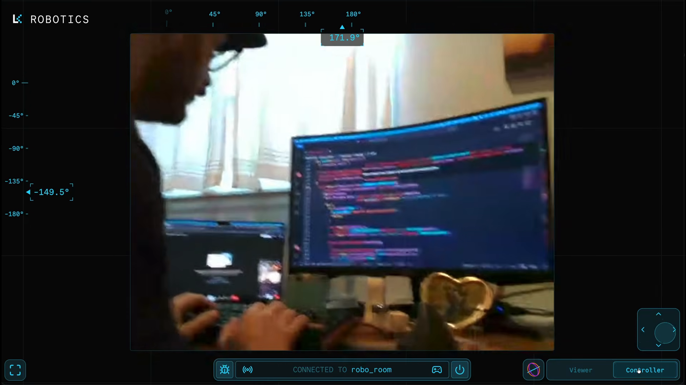

# LiveKit Teleop

An example demonstrating real-time robot teleoperation over [LiveKit](https://livekit.io). A camera-equipped pan/tilt robot publishes video, depth, gyroscope, and servo state as LiveKit tracks. Multiple users can access the web UI to view the live feeds, and a single operator can acquire control.

## Components

### Edge / Robot (C++) — [`pan_tilt_demo/`](pan_tilt_demo/README.md)

A C++ application built with the [LiveKit C++ SDK](https://github.com/livekit/rust-sdks) that runs on the robot (e.g. Jetson) and bridges the hardware to a LiveKit room.

- **PanTiltRobot** — drives Feetech STS3215 servos, reads an L3G4200D gyroscope, and streams RGB + depth from an Intel RealSense D415. Publishes all sensor state as LiveKit data and video tracks and accepts velocity commands gated by an `acquire_control` RPC.

- **TeleopController** — an optional desktop client that subscribes to the robot's tracks, renders the video feed in an SDL3 window, and sends keyboard-driven pan/tilt commands.

### Web UI (Next.js) — [`web/`](web/README.md)

A browser-based teleoperation interface built with Next.js, React, and the [LiveKit JS SDK](https://github.com/livekit/client-sdk-js). Provides a full-screen video viewport with on-screen joystick and keyboard controls for pan/tilt movement, live degree scales, and operator-mode locking.
